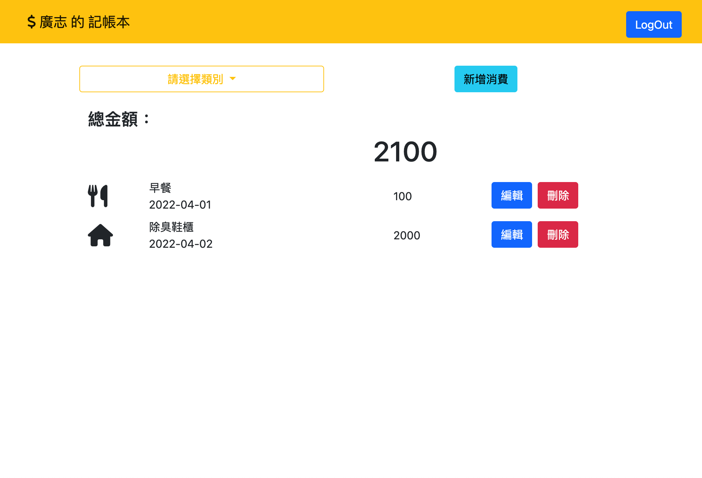
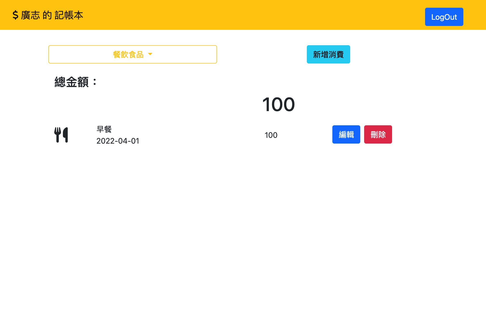
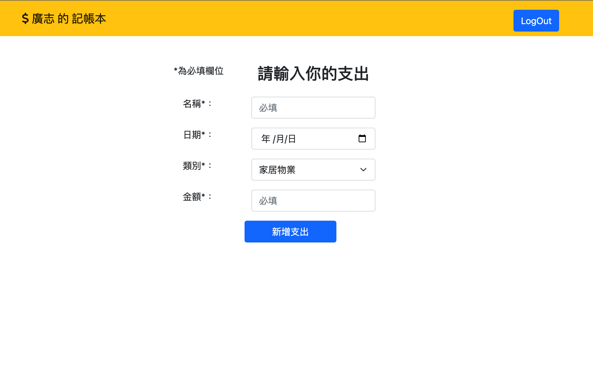
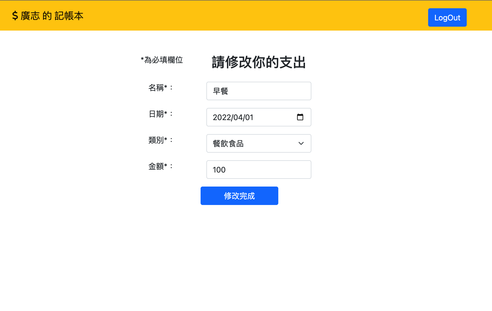
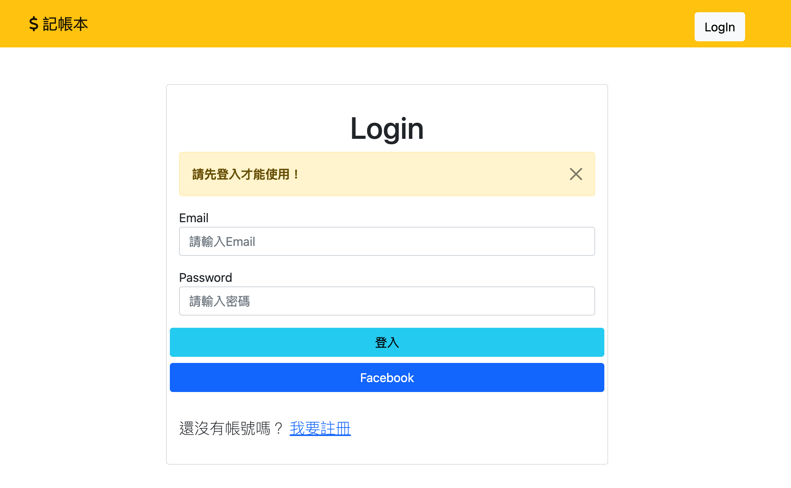
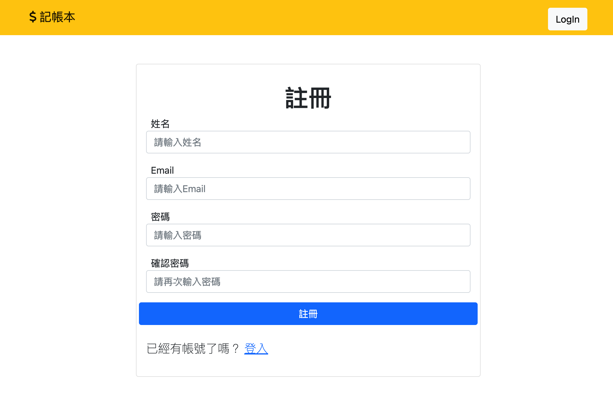

# favorite_restaurant









## 介紹

可以創建帳號或使用Facebook登入，開始管理屬於自己的消費記錄。

### 功能
- 可利用email或FB帳號進行註冊
- 可新增消費記錄
- 查看帳號內所有消費記錄
- 可顯示單一類別的消費記錄
- 可修改已儲存記錄
- 可刪除不需要的記錄

## 開始使用

1. 請先確認有安裝 node.js 與 npm
2. 將專案 clone 到本地
3. 在本地開啟之後，透過終端機進入資料夾，輸入：

   ```bash
   npm install
   ```

4. 安裝完畢後，繼續輸入：

   ```bash
   npm run dev
   ```

5. 若看見此行訊息則代表順利運行，打開瀏覽器進入到以下網址

   ```bash
   Listening on http://localhost:3000
   ```

6. 新增種子資料

   ```bash
   npm run seed
   ```

## 開發工具

- bcryptjs 2.4.3
- Bootstrap 5.1.3
- connect-flash 0.1.1
- dotenv 16.0.0
- Express 4.17.1
- Express-Handlebars 6.0.4
- express-session 1.17.2
- method-override 3.0.0
- mongoose 6.1.7
- Node.js 14.16.0
- passport 0.5.2
- passport-facebook 3.0.0
- passport-local 1.0.0